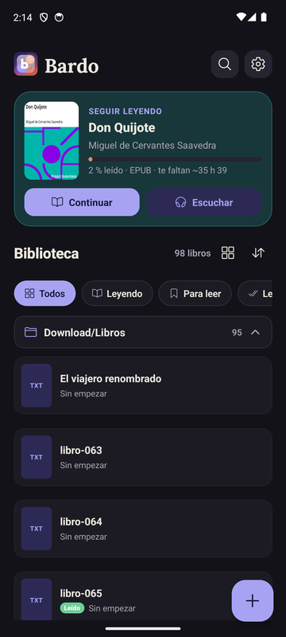
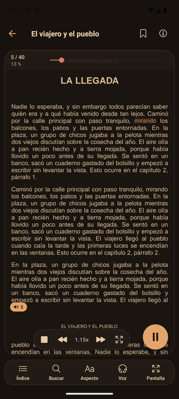
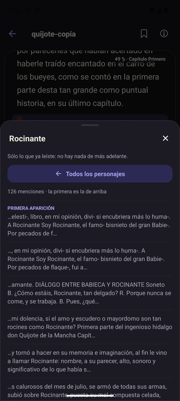
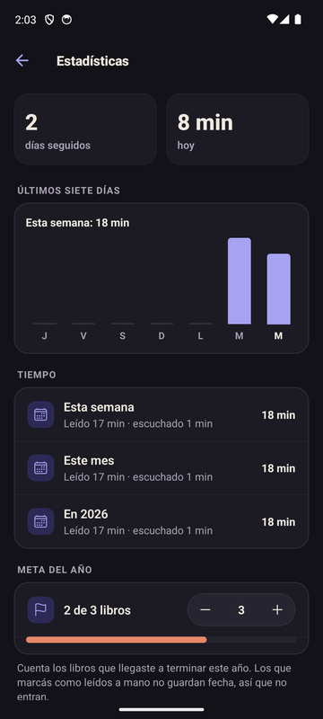

# Bardo

A book reader and narrator for Android. Open a PDF, EPUB, TXT, DOCX or a comic and read it or listen to it with the system voice while you look at the real page: the narration knows which page it is on, highlights the word being read and turns the page for you. Everything runs on the phone, with no server, no account and no connection.

*(Versión en español: [README.md](./README.md))*

| Library | Reader with voice | Characters | Stats |
| :---: | :---: | :---: | :---: |
|  |  |  |  |

## Features

**Reading**
- PDF drawn exactly as it is, fitted to the screen width, with continuous scroll or page turning, pinch zoom and automatic margin cropping.
- EPUB, TXT and DOCX in text mode, with adjustable typeface, size, line height and margins.
- CBZ, CBR, CB7 and CBT comics.
- Four themes: day, sepia, night and warm night, applied to PDF pages too.
- Table of contents from the file or detected in the text, a book map with chapters and annotations, and accent-insensitive search.

**Voice**
- Narration with Android's text-to-speech engine, offline. It keeps playing with the screen locked, with notification controls.
- The spoken word is highlighted on the page and the view turns pages on its own.
- Per-book speed and voice, a pronunciation dictionary, chapter announcements and a sleep timer.

**Library and annotations**
- Folder scanning, real covers, lists (to read, read, favorites), collections and series by folder.
- Bookmarks, quotes and notes that jump to their place; Markdown export and shareable quote images.
- Spoiler-free characters: the most frequent names up to where you have read, with no AI.
- Reading and listening time stats, streak and yearly goal.
- Export and import all your data as a JSON file.

## Stack

| Layer | Technology |
| --- | --- |
| App | React Native 0.83, Expo SDK 55, TypeScript, Expo Router |
| Data | SQLite (`expo-sqlite`) with versioned migrations |
| PDF | Own native module `bardo-pdf`: Android `PdfRenderer` and Pdfium (text, outline, coordinates) |
| Comics and EPUB | Own native module `bardo-archive`: `java.util.zip` and 7-Zip (RAR, 7z, tar), HTML-to-text converter |
| Voice | Own native module `voice-synthesizer`: `TextToSpeech.synthesizeToFile` |
| Playback | `expo-audio` in the background |
| Volume keys | Own native module `bardo-keys` |
| DOCX | `mammoth` |
| Tests | Vitest |

## Requirements

- Node.js 20 or newer
- JDK 17
- Android SDK with `platform-tools` and a device or emulator running Android 7.0 (API 24) or newer

The app ships its own native modules, so it does not run in Expo Go.

## Getting started

```bash
npm install
npx expo run:android
```

The first command installs the dependencies. The second generates the Android project if it does not exist, builds the app and installs it on the connected device. There are no keys or services to configure.

Checks:

```bash
npm run typecheck
npm run lint
npm test
```

Release APK:

```bash
npx expo prebuild --platform android
cd android && ./gradlew assembleRelease -PreactNativeArchitectures=arm64-v8a
```

The output is `android/app/build/outputs/apk/release/app-release.apk`. After changing anything under `modules/`, rebuild.

## Architecture

All reading state uses a single unit: the **character offset within the book's text**. Progress, voice, search and annotations point at the same place, which is why reading and listening share one position. For PDFs, `pageOffsets` (where each page starts inside the text) translates between offset and page both ways.

```
file ──► parser (per format) ──► ParsedDocument ──► local cache ──► reader
                                 text + blocks        SQLite or disk    │
                                 + chapters                             ├─► PdfPageList: pages on demand (bardo-pdf)
                                 + pageOffsets                          └─► voice: chunks ──► WAV (voice-synthesizer) ──► expo-audio
                                                                                   playback position ──► offset ──► page
```

- **Instant open.** A PDF shows its page right away; the text for voice and search is prepared in the background. Reopening a processed book reads the cache, not the file.
- **Pages on demand.** The reader requests each page from a LIFO queue with cancellation: what is on screen is drawn first and what already scrolled away is dropped. Rendered pages are cached on disk with a size cap.
- **File-based voice.** The text is cut into chunks that end at sentence boundaries. The system engine writes one WAV per chunk, two are prepared ahead, and the playback position is translated back to a character offset. Working with files is what makes background playback, lock screen and rewind work.

Data model:

```
Book  ── status · favorite · rating · review · orderIndex
 ├── Chapter            from the file's outline or detected in the text
 ├── Note               bookmark | quote | note
 ├── ReadingProgress    character offset, percentage and page
 ├── ReadingStats       seconds read and listened per day
 └── Collection (N:N)
```

## Project structure

```
app/                    screens (Expo Router)
  index.tsx               library
  reader.tsx              reader (pages or text) and voice
  book.tsx                book details
  notes.tsx · stats.tsx · pronunciation.tsx · settings.tsx
src/
  components/             UI pieces: PdfPageList, ReaderBlockCard, BookMapBar, ui
  hooks/                  useReaderController, useAppSettings
  services/               parsers, local PDF, voice, library scanning, backup
  storage/                schema, migrations and SQLite repositories
  utils/                  pure logic with tests
  types/                  contracts between layers
modules/
  bardo-pdf/              PDF rendering, text, outline and coordinates (Kotlin, Pdfium)
  bardo-archive/          comics, EPUB, SAF scanning and file fingerprints (Kotlin, 7-Zip)
  voice-synthesizer/      text-to-speech to a WAV file (Kotlin)
  bardo-keys/             volume key capture (Kotlin)
docs/
  research/               design decisions, audits and measurements
  brand/                  visual identity and previous logos
  screenshots/            screenshots for this README
  ops/                    operational procedures
  hub/                    project coordination notes
assets/                   icons, splash and typography (Lora, OFL license)
```

The `android/` folder is not in the repository: it is generated with `expo prebuild` from `app.json` and the modules.

## Quality

- Strict TypeScript and ESLint with no warnings.
- 413 Vitest tests over pure functions: text partitioning, page mapping, progress, chapters, stats and backup. Every file in `src/utils/` has its `.test.ts` next to it.
- A JVM test for the HTML-to-text converter in the `bardo-archive` module.
- Schema migrations versioned with `PRAGMA user_version`; a failed migration does not bump the version and is retried on the next start.
- Performance measured before and after every large change (cold start and memory with the reader narrating).

## Status

Version 2.0.0, under device testing. Publication on Google Play is planned.
